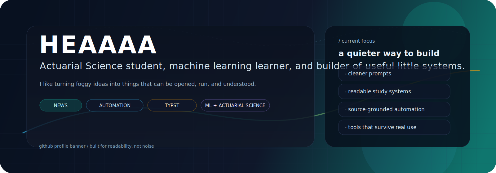

  

### Field notes

I am Heaaaa, an Actuarial Science student who likes turning fuzzy ideas into useful systems.

- I learn best by building.
- I prefer clear workflows over flashy ones.
- I spend a lot of time around machine learning, finance, automation, and study tools.
- I like projects that explain themselves without needing much hand-holding.

### Snapshot

| Field | Value |
| --- | --- |
| Base | Heriot-Watt University |
| Mode | learning by building |
| Focus | ML, actuarial science, automation |
| Favorite output | something another person can actually use |
| Personal rule | make it smaller, then make it clearer |

### Current orbit

- `News` - daily news automation with source checking
- `Doc chat` - document-grounded local AI workflows
- `Typst notes` - clean study documents and PDF output
- `Web experiments` - interactive pages and motion-driven ideas

### Toolbench

| Tool | Where it shows up |
| --- | --- |
| Python | automation, AI glue, small scripts |
| Typst | study notes and compile-ready documents |
| JavaScript | browser experiments and front-end ideas |
| Bash | local launchers and quick helpers |
| Git / GitHub | versioned work and publishing |
| Markdown | writing things down so they can be reused |

### What I am building toward

| Thread | Why it matters |
| --- | --- |
| Clearer AI workflows | fewer surprises, better outputs, easier reuse |
| Better study systems | notes that are readable now and useful later |
| Smaller tools | simple utilities that solve one job well |
| Cleaner pages | profiles and projects that feel intentional |

### Working style

1. Start with a rough version.
2. Strip away what does not help.
3. Test it on real inputs.
4. Keep the parts that survive contact with reality.

  
Desk drawer

- I like systems that are quiet, readable, and repeatable.
- I keep circling back to study workflows, AI helpers, and one-off tools until they feel clean.
- I would rather have one useful project than ten noisy ones.

### Links

- GitHub: [github.com/Heaaaaaaaa](https://github.com/Heaaaaaaaa)
- Featured repo: [News](https://github.com/Heaaaaaaaa/News)

Built like a notebook, not a billboard.

